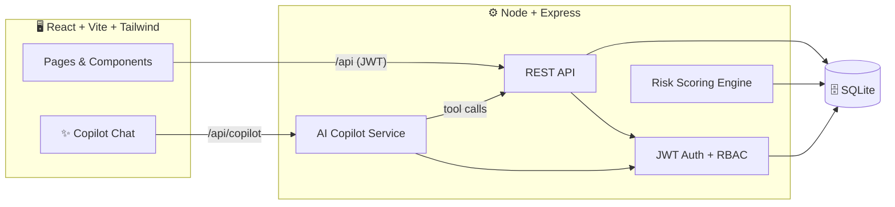

<!-- ══════════════════ HEADER ══════════════════ -->
<div align="center">


<a href="https://git.io/typing-svg">
  
</a>

<br/>


<br/><br/>


</div>


<!-- ══════════════════ ABOUT ══════════════════ -->

## 🌟 Overview

**Aligned HRMS** digitizes every core HR operation into one clean, role-aware dashboard — and then goes a step further with an **AI Copilot** that turns plain English into real actions and flags attrition risk before a human even looks.

<div align="center">

> _“Apply sick leave next Monday to Wednesday.”_ → **done.**
> _“How many leaves do I have left?”_ → **answered from live data.**

</div>


<!-- ══════════════════ FEATURES ══════════════════ -->

## ✨ Features

<table>
<tr>
<td width="50%" valign="top">

### 👤 For Employees
- 🔐 Secure sign-up / sign-in
- 🏠 Personal dashboard with quick-access cards
- 📅 One-click **check-in / check-out**
- 🗓️ Monthly attendance calendar with color markers
- 🌴 Apply for leave by **selecting a range on the calendar**
- 💰 Read-only salary breakdown
- 🤖 **AI Copilot** chat — apply for leave & ask questions in plain English

</td>
<td width="50%" valign="top">

### 🧑‍💼 For HR / Admin
- 👥 Full employee directory + live "today" status
- ✅ Leave approval queue (approve / reject / comment)
- 🧠 **Auto attrition-risk score (0–100)** on every request
- 💡 AI insight line explaining *why* a request is risky
- 💵 Editable salary structures, instant net recalculation
- 📊 At-a-glance KPI cards (pending, high-risk, headcount)

</td>
</tr>
</table>


<!-- ══════════════════ STANDOUT ══════════════════ -->

## 🤖 The Standout — Aligned Copilot

<div align="center">

</div>

| Side | What it does |
|------|--------------|
| 🧑 **Employee** | Natural-language assistant. Resolves relative dates, files leave requests, checks balances, summarizes attendance — all through tool-calling. |
| 🧑‍💼 **HR** | Each pending request is enriched with a **risk score**, a human-readable insight, and an Approve/Review recommendation. |

**Supported intents** (parsed in `server/src/nlp.js`, executed in `routes/copilot.js`):

| Intent | Example prompt | Action |
|--------|----------------|--------|
| `apply_leave` | *"Apply sick leave next Mon–Wed"* | drafts a leave request → confirm card → submits |
| `get_leave_balance` | *"How many paid leaves do I have left?"* | reads leave history + policy → answers |
| `get_attendance_summary` | *"Was I late this week?"* | summarizes attendance rows in plain English |

Date parsing covers relative dates (*"next Monday"*), explicit ISO dates, ranges, and *"for N days"*.

> 🛡️ **Privacy-first & self-contained:** the Copilot runs entirely on your own server with a built-in natural-language engine — **no external AI service, no API keys, no data leaves your machine.** Every action is bound to the caller's user id, so it cannot read or touch another employee's data.


<!-- ══════════════════ ARCHITECTURE ══════════════════ -->

## 🏗️ Architecture




<!-- ══════════════════ QUICKSTART ══════════════════ -->

## 🚀 Quick Start

> **Prerequisites:** Node `>=22` (repo pins `22.20.0` via `.nvmrc` — run `nvm use`) · npm `>=10`. No database setup needed — SQLite is file-based and auto-created on seed.

```bash
# 1️⃣  install everything (root + server + client)
npm run install:all

# 2️⃣  seed demo data — 5 users, 30 days of attendance, sample leave
npm run seed

# 3️⃣  launch backend + frontend together
npm run dev
```

<div align="center">

🌐 **Frontend** → `http://localhost:5173`  ·  🔌 **API** → `http://localhost:4000`

</div>

### 🔑 Demo Accounts &nbsp;·&nbsp; password: `password1`

| Role | Email | Notes |
|:----:|-------|-------|
| 🧑‍💼 **HR** | `hr@aligned.com` | approvals, payroll, full directory |
| 🧑 **Employee** | `rimjhim@aligned.com` | standard profile |
| ⚠️ **Employee** | `monmon@aligned.com` | seeded **high attrition-risk** (best for the HR demo) |

### 📜 npm Scripts

| Command | Does |
|---------|------|
| `npm run dev` | run server + client together (concurrently) |
| `npm run install:all` | install root + server + client deps |
| `npm run seed` | seed demo data |
| `npm run setup` | `install:all` then `seed` — one-shot bootstrap |
| `npm run build` | production build of the client |
| `npm run preview` | preview the built client |
| `npm start` | run the server alone (production) |
| `npm run lint` | lint the client |


<!-- ══════════════════ SCREENS (collapsible) ══════════════════ -->

## 📸 Walkthrough

<details>
<summary><b>🔐 Click to expand — Login & Dashboards</b></summary>
<br/>

| Login | HR Dashboard | Employee Dashboard |
|:---:|:---:|:---:|
|  |  |  |

</details>

<details>
<summary><b>🧠 Click to expand — AI Copilot & Smart Approvals</b></summary>
<br/>

| Copilot (plain-English actions) | HR Smart Approvals (risk scores) |
|:---:|:---:|
|  |  |

</details>

<details>
<summary><b>📅 Click to expand — Attendance & Leave Calendar</b></summary>
<br/>

| Attendance (check-in + markers) | Leave (range-select apply) |
|:---:|:---:|
|  |  |

</details>


<!-- ══════════════════ MODULES ══════════════════ -->

## 🧩 Modules

<div align="center">

| Module | Employee | HR / Admin |
|--------|:--------:|:----------:|
| 🔐 Auth & RBAC | sign up / in | + manage roles |
| 🏠 Dashboard | quick cards | team KPIs |
| 👤 Profile | edit limited fields | edit all fields |
| 📅 Attendance | check-in/out, own view | everyone's status |
| 🌴 Leave | apply, track | approve / reject + risk |
| 💰 Payroll | read-only | edit structures |
| 🤖 Copilot | chat & actions | risk insights |

</div>


<!-- ══════════════════ STACK ══════════════════ -->

## 🛠️ Tech Stack

<div align="center">

**Frontend** &nbsp;·&nbsp; React 18 · Vite · TypeScript · Tailwind CSS · React Router
**Backend** &nbsp;·&nbsp; Node · Express · JWT · bcrypt
**Database** &nbsp;·&nbsp; SQLite (better-sqlite3) — zero-config, real persistence
**Copilot** &nbsp;·&nbsp; self-contained natural-language engine (relative-date parsing + intent detection) — no external services

</div>


<!-- ══════════════════ STRUCTURE ══════════════════ -->

## 📂 Project Structure

```
odoo/
├── server/                 ⚙️  Express API + SQLite
│   └── src/
│       ├── routes/         🔌  auth · profiles · attendance · leave · payroll · copilot
│       ├── index.js        🚪  Express app entry + route mounting
│       ├── auth.js         🔐  JWT, bcrypt, role middleware
│       ├── nlp.js          💬  natural-language intent + date parser
│       ├── risk.js         🧠  attrition-risk scoring engine
│       ├── db.js           🗄️  schema + connection
│       └── seed.js         🌱  demo data
└── client/                 🖥️  React SPA
    └── src/
        ├── pages/          📄  screens (dashboard, leave, payroll, …)
        ├── components/     🧩  Layout · Calendar · Copilot · UI kit
        └── lib/            🔗  api client + auth context
```


<!-- ══════════════════ TEAM ══════════════════ -->

## 👥 Team

<div align="center">

Built with 💜 for the **Odoo x Adamas University Hackathon '26**

**Sreya Datta Gupta** · **Rimjhim Barnwal** · **Pubali Digar** · **Monmon Ghosh**

<br/>


</div>
